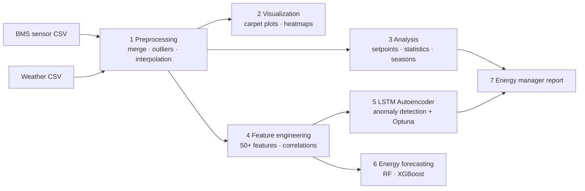

# HVAC Analytics & LSTM Anomaly Detection

> End-to-end pipeline for HVAC performance analysis and unsupervised anomaly
> detection on real Building Management System (BMS) sensor data —
> MSc thesis project (University of Turin) developed in industry collaboration
> with [Eurix](https://www.eurix.it/).

[](https://www.python.org/)
[](https://www.tensorflow.org/)
[](LICENSE)

Multivariate time-series data from an Air Handling Unit (AHU) — supply/return/
saturation temperatures, setpoints, fan modulation — is merged with weather
data, cleaned, feature-engineered, and fed to a **stacked LSTM Autoencoder**
that detects anomalies without any fault labels: the model trains only on
normal operation and flags sequences it cannot reconstruct.

> **Data note:** the real BMS data is confidential and not included. The repo
> ships a [synthetic data generator](data/README.md) that reproduces the exact
> BMS export format, so the entire pipeline runs out of the box.

---

## Key results (real data, two seasons)

Full write-up: [`LSTM_AE_Results_Report.md`](scripts/5_lstm_anomaly_detection/LSTM_AE_Results_Report.md)

- **Per-feature reconstruction error (RMSE, % of signal range):** supply air
  3.3% (summer) / 4.7% (winter); return air down to 0.7% in winter —
  near-perfect reconstruction of the most schedule-driven signal.
- **Detected a critical winter anomaly (~2026-02-12):** reconstruction error
  spiked to ≈5× the seasonal baseline, isolated by per-feature error
  attribution to the supply-temperature circuit — flagged for physical
  inspection (sensor, actuator, or heating-coil fault).
- **Dynamic EMA thresholding** adapts to slow regime changes (autumn outdoor
  temperature drop) without false-positive floods, while still catching
  localized spikes; a static 95th-percentile threshold is available for
  slow-degradation monitoring.
- **Physics-informed feature selection:** exogenous (weather) and
  algebraically-derived signals are excluded from reconstruction and handled
  as rule-based checks instead — the model scores *"is the AHU behaving
  correctly given the conditions?"*, not *"did the weather change?"*.
- Hyperparameters tuned with **Optuna** per season (best-trial configs
  included in the repo).

## Pipeline



## Repository structure

```
├── config.ini                      # Single config: change 4 variables, everything follows
├── config_utils.py                 # Shared config loader
├── data/
│   ├── generate_sample_data.py     # Synthetic BMS-format sample data (start here)
│   └── README.md                   # Data dictionary + confidentiality note
└── scripts/
    ├── 1_data_preprocessing/       # Merge, missing-data analysis, outliers, interpolation
    ├── 2_data_visualization/       # Carpet plots, weekly heatmaps, operation analysis
    ├── 3_data_analysis/            # Setpoint tracking, descriptive stats, season comparison
    ├── 4_feature_engineering/      # Feature creation, correlation & importance analysis
    ├── 5_lstm_anomaly_detection/   # 11-module LSTM-AE system (see its README)
    ├── 6_energy_forecasting/       # Linear / Random Forest / XGBoost forecasting
    └── 7_energy_manager_report/    # Consolidated report for facility managers
```

## Quick start

```bash
git clone https://github.com/VaragaHaghoubians/hvac-lstm-anomaly-detection.git
cd hvac-lstm-anomaly-detection
python -m venv .venv
# Windows: .venv\Scripts\activate   |   Linux/macOS: source .venv/bin/activate
pip install -r requirements.txt

# 1. Generate runnable sample data (real data is confidential)
python data/generate_sample_data.py

# 2. Preprocess
python scripts/1_data_preprocessing/1_merged_data.py
python scripts/1_data_preprocessing/5_cleaning_and_interpolation.py

# 3. Engineer features
python scripts/4_feature_engineering/1_feature_engineering.py

# 4. Detect anomalies (needs tensorflow — see scripts/5_lstm_anomaly_detection/requirements.txt)
cd scripts/5_lstm_anomaly_detection
python 0_test_setup.py     # verify environment
python 1_main.py           # train + evaluate LSTM-AE
```

Everything is driven by `config.ini` — set `building_id`, `ahu_unit`, `season`,
`year` once and all file paths, date ranges, and thresholds follow.

## Method highlights

- **Leak-free chronological splits:** 70/15/15 by calendar week, no shuffling —
  train on early season, test on late season, mirroring real deployment.
- **RobustScaler fitted on train only**, with automatic post-scaling variance
  checks that drop flatlined sensors (e.g., a fan locked at 80% all winter).
- **Clean-training mask:** sequences containing system-off periods, physical
  threshold violations, or long interpolated gaps are excluded from training
  but kept for evaluation.
- **MAE loss over MSE** to avoid over-penalizing reconstruction wiggle on
  near-constant signals.
- **Severity triage** (minor / moderate / critical at 1.0× / 1.5× / 2.5×
  threshold) plus per-feature error attribution, so a flagged anomaly points
  at the responsible signal.

## Tech stack

Python · pandas · NumPy · scikit-learn · TensorFlow/Keras · Optuna · XGBoost ·
Matplotlib · Seaborn · SciPy

## Author

**Varaga Haghoubians** — MSc Stochastics & Data Science, University of Turin
· ML/AI Engineer Intern @ Eurix
· [LinkedIn](https://www.linkedin.com/in/varagahaghoubians) · varaga.haghoubians@gmail.com

Thesis: *Advanced Data Analysis for HVAC System Characterization and Evaluation
of Environmental Comfort and Energy Performance* — developed with real BMS data
in collaboration with Eurix and the University of Turin.

## License

Code is released under the [MIT License](LICENSE). The real sensor data
underlying the published results is confidential and remains the property of
the data owners.
