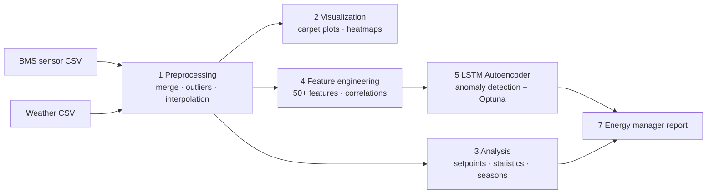

# HVAC Analytics & LSTM Anomaly Detection

> End-to-end pipeline for HVAC performance analysis and unsupervised anomaly
> detection on real Building Management System (BMS) sensor data,
> MSc thesis project (University of Turin) developed in industry collaboration
> with [Eurix](https://www.eurix.it/).

[](https://www.python.org/)
[](https://www.tensorflow.org/)
[](LICENSE)

Multivariate time-series data from an Air Handling Unit (AHU), supply/return/
saturation temperatures, setpoints, fan modulation, is merged with weather
data, cleaned, feature-engineered, and fed to a **stacked LSTM Autoencoder**
that detects anomalies without any fault labels: the model trains only on
normal operation and flags sequences it cannot reconstruct.

> **Data note:** The real BMS data is confidential and not included. The repo
> ships a [synthetic data generator](data/README.md) that reproduces the exact
> BMS export format, so the entire pipeline runs out of the box.

---

## Real-data results (confidential Eurix extract)

The numbers in [`LSTM_AE_Results_Report.md`](scripts/5_lstm_anomaly_detection/LSTM_AE_Results_Report.md) are real-data results from the Eurix internship on Building C1, AHU UTA1. The public sample from [`generate_sample_data.py`](data/generate_sample_data.py) cannot reproduce them. The confidential BMS extract is not in this repo.

The winter spike in that report is a suspected anomaly on the company extract. No coil, sensor, or actuator fault was confirmed.

## Pipeline


```mermaid
flowchart LR
    A[BMS sensor CSV] --> C[1 Preprocessing<br/>merge · outliers · interpolation]
    B[Weather CSV] --> C
    C --> D[2 Visualization<br/>carpet plots · heatmaps]
    C --> E[3 Analysis<br/>setpoints · statistics · seasons]
    C --> F[4 Feature engineering<br/>50+ features · correlations]
    F --> G[5 LSTM Autoencoder<br/>anomaly detection + Optuna]
    G --> I[7 Energy manager report]
    E --> I
```

## Repository structure

```
├── config.ini                      # Single config: change 4 variables, everything follows
├── config_utils.py                 # Shared config loader
├── data/
│   ├── generate_sample_data.py     # Synthetic BMS-format sample data (start here)
│   └── README.md                   # Data dictionary + confidentiality note
└── scripts/
    ├── 1_data_preprocessing/       # Merge, missing-data analysis, outliers, interpolation
    ├── 2_data_visualization/       # Carpet plots, weekly heatmaps, operation analysis
    ├── 3_data_analysis/            # Setpoint tracking, descriptive stats, season comparison
    ├── 4_feature_engineering/      # Feature creation, correlation & importance analysis
    ├── 5_lstm_anomaly_detection/   # 11-module LSTM-AE system (see its README)

```

## Quick start

```bash
git clone https://github.com/VaragaHaghoubians/hvac-lstm-anomaly-detection.git
cd hvac-lstm-anomaly-detection
python -m venv .venv
# Windows: .venv\Scripts\activate   |   Linux/macOS: source .venv/bin/activate
pip install -r requirements.txt

# 1. Generate runnable sample data (real data is confidential)
python data/generate_sample_data.py

# 2. Preprocess
python scripts/1_data_preprocessing/1_merged_data.py
python scripts/1_data_preprocessing/5_cleaning_and_interpolation.py

# 3. Engineer features
python scripts/4_feature_engineering/1_feature_engineering.py

# 4. Detect anomalies (needs TensorFlow - see scripts/5_lstm_anomaly_detection/requirements.txt)
cd scripts/5_lstm_anomaly_detection
python 0_test_setup.py     # verify environment
python 1_main.py           # train + evaluate LSTM-AE
```

Everything is driven by `config.ini` - set `building_id`, `ahu_unit`, `season`,
`year` once, and all file paths, date ranges, and thresholds follow.

## Method highlights

- **Chronological week split:** first 70% of weeks train, next 15% validation, last 15% test. `3_preprocessor.py` always does this. It does not read `split_strategy`.
- **RobustScaler fitted on train only**, with automatic post-scaling variance
  checks that drop flatlined sensors (e.g., a fan locked at 80% all winter).
- **Clean-training mask:** sequences containing system-off periods, physical
  threshold violations, or long interpolated gaps are excluded from training
  but kept for evaluation.
- **MAE loss over MSE** to avoid over-penalizing reconstruction wiggle on
  near-constant signals.
- **Severity triage** (minor / moderate / critical at 1.0× / 1.5× / 2.5×
  threshold) plus per-feature error attribution, so a flagged anomaly points
  at the responsible signal.

## Tech stack

Python · pandas · NumPy · scikit-learn · TensorFlow/Keras · Optuna · XGBoost ·
Matplotlib · Seaborn · SciPy

## Author

**Varaga Haghoubians, **MSc Stochastics & Data Science, University of Turin
· Data Analyst · Industrial Engineering · Operations
· [LinkedIn](https://www.linkedin.com/in/varagahaghoubians) · varaga.haghoubians@gmail.com

Thesis: *Advanced Data Analysis for HVAC System Characterization and Evaluation
of Environmental Comfort and Energy Performance*. Pipeline written during a curricular internship at Eurix. The published results are real-data results from the confidential BMS extract. The synthetic generator cannot reproduce them.

## License

Code is released under the [MIT License](LICENSE). The confidential BMS extract
is not in this repository.
